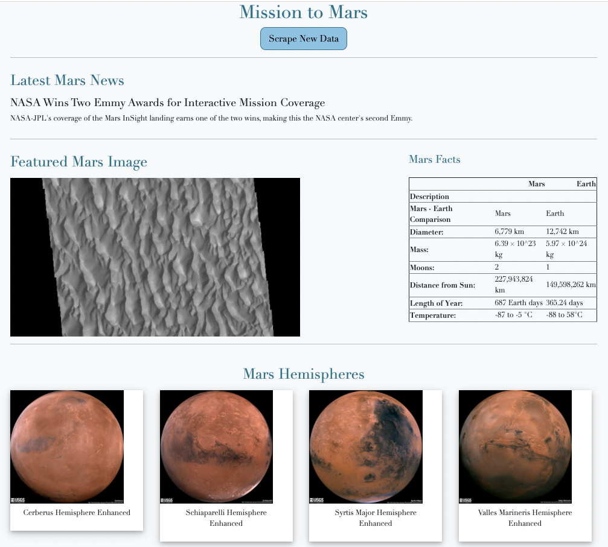

### web-scraping-challenge
# Mission to Mars

### This assignment was to build a web application that scrapes elements from four different websites and displays the information in a single HTML Page.
----------------------------
----------------------------
## The screen shot of my final app:

## Process
I first used Jupyter Lab to create the code needed for scraping and analyzing the data requested in the assignment.

I then converted my Jupyter Lab code into a Python script to execute all the scraping code and return one Python dictionary that contained all the scraped data.
* This code includes a button that, when clicked, re-executes the the code and the new, refreshed data is displayed.

I also created an app that had two routes:
* The scrape route - "/scrape" - imported my Python scraping script and called the scrape function. It then stored the returned values in Mongo as a Python dictionary.
* The root route - "/" - queried the Mongo database and passed the scraped elements into and HTML template to display the data.

And to render the data, I created an HTML file that took the dictionary and displayed all the data in the appropriate HTML elements.

## Summary
The final product was a web application created with Flask that included the latest article title and teaser scraped from a webpage about Mars, images scraped from a couple different webpages, and a table with data comparing Mars to Earth scraped from another webpage.

Each time the "Scrape New Data" button is clicked new information is updated on the webpage and in the Mongo database.

## Code
* App Script: app.py
* Scraping Script: scrape_mars.py
* HTML code: index.html
* Jupyter Lab code: mission_to_mars.ipynb (not necessary to run the app)
